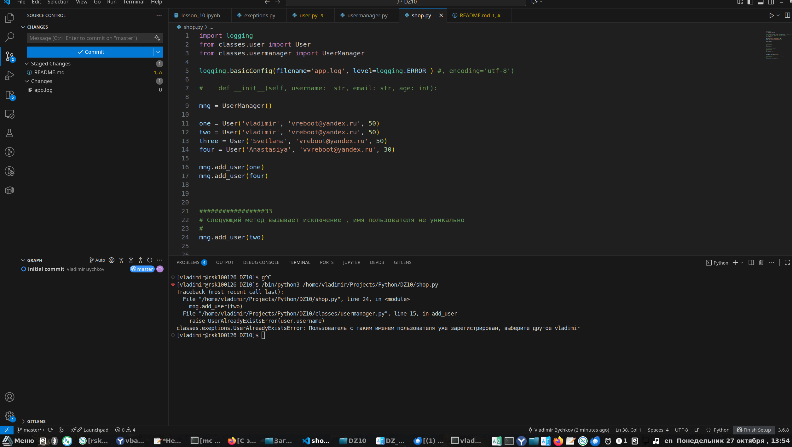

## Задание: Создание и обработка сложных сценариев с собственными типами исключений

### Цель: Научиться эффективно обрабатывать ошибки и исключения в сложных сценариях, разрабатывать собственные типы исключений и обеспечивать их корректное использование в программе.

#### Описание задания:
Вам нужно разработать систему для управления пользователями в контексте интернет-магазина. Система должна включать в себя следующие компоненты:
-    1. Класс User: Класс пользователя с атрибутами username, email, и age.
-    2. Класс UserManager: Менеджер пользователей, который позволяет добавлять, удалять и находить пользователей.
-    3. Пользовательские исключения: Разработайте собственные типы исключений для обработки различных ошибок, связанных с пользователями.
-    4. Обработка ошибок: Реализуйте обработку исключений при выполнении операций с пользователями.

Требования:
-    1. Класс User:
        ◦ Атрибуты: username (строка), email (строка), age (целое число).
        ◦ Методы:
            ▪ __init__: Инициализация атрибутов.
            ▪ __str__: Преобразование объекта в строку для удобного вывода.
-    2. Класс UserManager:
        ◦ Атрибуты:
            ▪ users: Словарь, где ключами являются username, а значениями — объекты класса User.
        ◦ Методы:
            ▪ add_user(self, user: User): Добавляет пользователя в словарь. Если пользователь с таким именем уже существует, должен выбрасываться UserAlreadyExistsError.
            ▪ remove_user(self, username: str): Удаляет пользователя из словаря. Если пользователя с таким именем не существует, должен выбрасываться UserNotFoundError.
            ▪ find_user(self, username: str) -> User: Возвращает пользователя по имени. Если пользователя не существует, должен выбрасываться UserNotFoundError.
-    3. Пользовательские исключения:
        ◦ UserAlreadyExistsError: Исключение, выбрасываемое, если пытаются добавить пользователя с уже существующим именем.
        ◦ UserNotFoundError: Исключение, выбрасываемое, если пользователь с указанным именем не найден.
-    4. Обработка ошибок:
        ◦ В основной функции программы:
            ▪ Пробуйте добавить несколько пользователей с одинаковыми именами и обрабатывайте исключения.
            ▪ Попробуйте удалить пользователей, которых нет в словаре, и обрабатывайте исключения.
            ▪ Попробуйте найти пользователя по имени и обрабатывайте исключения, если пользователь не найден.

